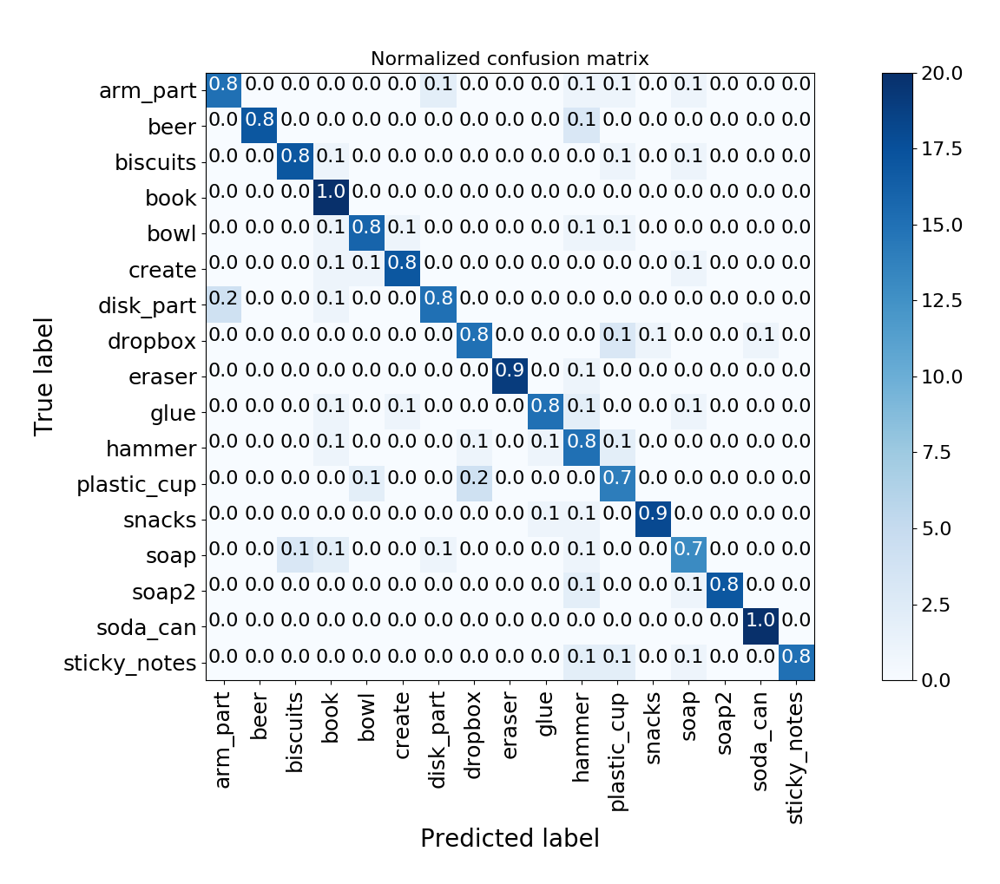
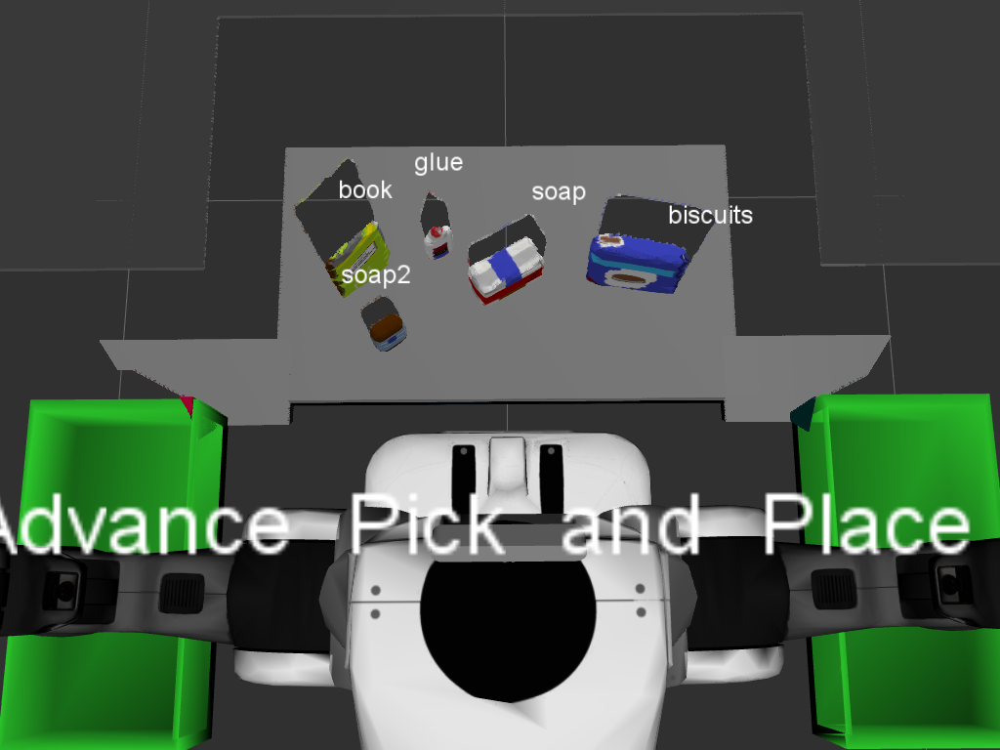
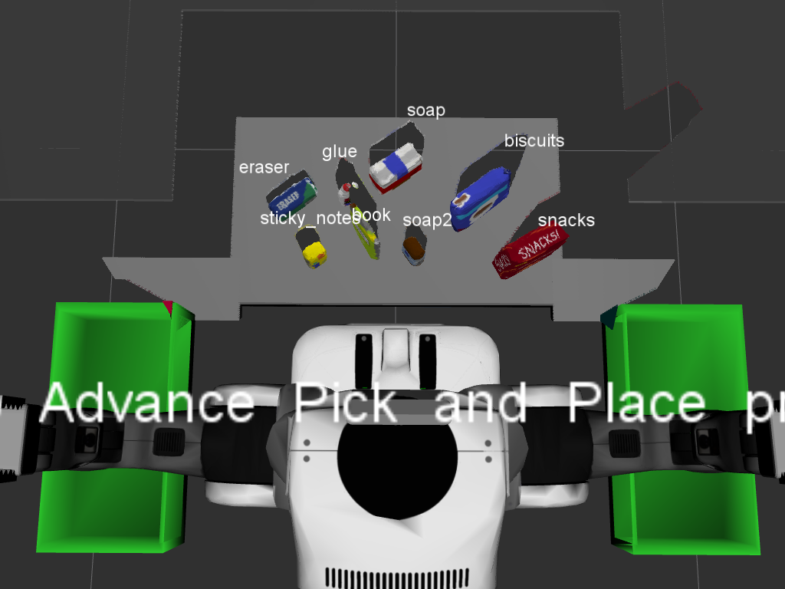

# PR2 3D Perception and Pick&Place
Jun Zhu


## Installation

Move the folder to the catkin_ws/src directory of your active ROS workspace.

**Note: If you have the other projects in the same ROS Workspace as this project containing 'gazebo_grasp_plugin' directory, please remove it.** 

Install missing dependencies and build the project:

```sh
cd [your path]/catkin_ws

rosdep install --from-paths src --ignore-src --rosdistro=kinetic -y

catkin_make
```

Add following to your .bashrc file

```
export GAZEBO_MODEL_PATH=[your path]/catkin_ws/src/RoboND-Perception-Project/pr2_robot/models
source [your path]/catkin_ws/devel/setup.bash

source ~/.bashrc
```

Install cython
```
$ sudo pip install cython
```

Build and Install pcl-python

```
$ cd [your path]/python-pcl
$ python setup.py build
$ sudo python setup.py install
```

Install pcl-tools
```
$ sudo apt-get install pcl-tools
```

## Classification

### Train the classifier

First, generate features. The list `model` in the file `capture_features.py` should contain at least all the models that you want to classify. Move the models in the list to the folder `sensor_stick/models` (e.g. move some models previously only existing in `pr2_robot/models`)
 
```
roslaunch sensor_stick training.launch
rosrun sensor_stick capture_features.py
```

Second, train a SVM classifier

```
rosrun sensor_stick train_svm.py
```




### Load different table environments
Change two entries ('test3.world' and 'pick_list_3.yaml') in the following two lines in the file `pick_place_project.launch`
```
arg name="world_name" value="$(find pr2_robot)/worlds/test3.world" 
    
rosparam command="load" file="$(find pr2_robot)/config/pick_list_3.yaml"
```

### Classify the PR2 RGB-D camera world

```
roslaunch pr2_robot pick_place_project.launch

./clustering.py
```
There is noise in the processed cloud since the StatisticalOutlierRemover filter is broken in pcl-python.

  

## Pick and place

### Dump the pick&place requests to the YAML file

Keep the scripts in the previous step running, and then 

```
# The second argument (test scene number) is optional
python2 pick_and_place.py 2
```