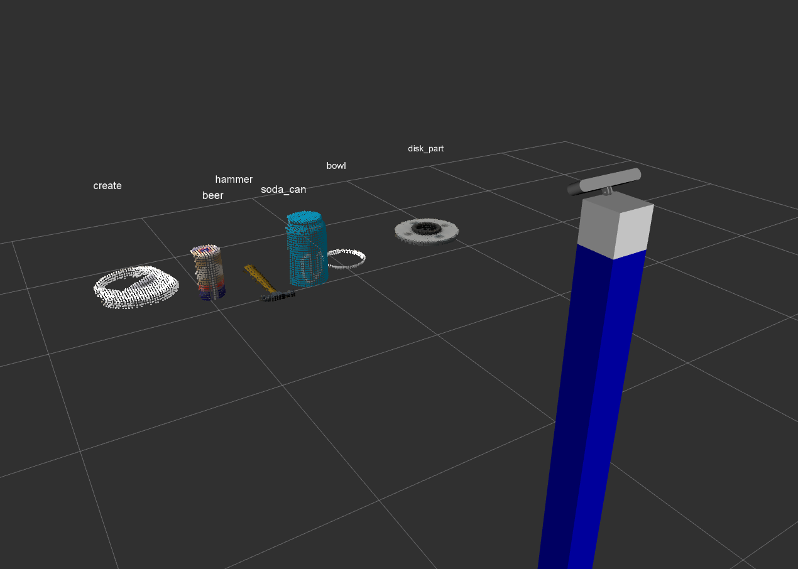

# Robotic Perception Exercise




## Classification

For segmentation only, directly go to the last step.

### Generate features
```
roslaunch sensor_stick training.launch

rosrun sensor_stick capture_features.py
```

### Train the classifier

```
rosrun sensor_stick train_svm.py
```
To improve the prediction model:
- Use a larger set of randomly oriented objects
- Use HSV color space 
- Try different bins of histogram
- Change hyperparameters for the classifier

### Run

```
roslaunch sensor_stick robot_spawn.launch

./run.py
```
For details of the point cloud processing, see the function `pcl_callback` in `run.py`. 

